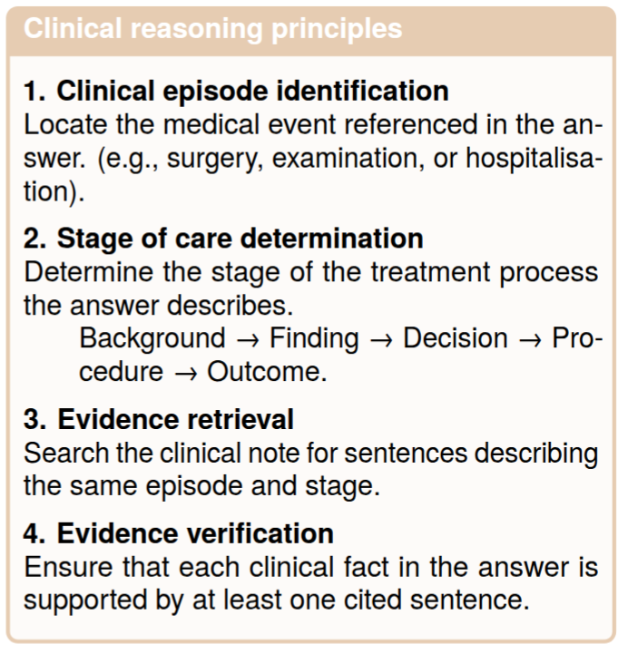

# MedEvi-NS @ ArchEHR-QA 2026 Task 4    

### [📊 ArchEHR-QA 2026 Task 4 Competition](https://www.codabench.org/competitions/13528/)

This repository represent a code for paper [MedEvi-NS at ArchEHR-QA 2026: Using clinical reasoning
principles to improve zero-shot capabilities of Large Language Models in Evidence Alignment]() @ [LREC 2026](https://www.elra.info/lrec2026/).
The task aims at citing suporting sentences from patient excerpt notes to each sentence from answers to patient question.

This is an implementation of the  prompt-engineering methodology that features **clinical-reasoning principles** (See figure below) in related alignment. 
We adopt this methodology for `GPT-5.2` in zero-shot learning mode. 

<p align="center">
  
</p>


# Installation

```bash
pip3 install -r dependencies.txt
```

# Usage 

## Inference

We use [`bulk-chain` project](https://github.com/nicolay-r/bulk-chain) to perform fast-inference with native support batching and async API querying.

**Supported providers:** OpenAI, Replicate.

> **More providers at:** https://github.com/nicolay-r/nlp-thirdgate

Navigate to `src` directory.

```python
python pred.py  \
    --model_name "gpt-5.2-2025-12-11"  \
    --provider_path "providers/openai_156.py"  \
    --dataset_name "train_qa_without_cite" \
    --api_token OPENAI_TOKEN_GOES_HERE
```

## Result Evaluation

Proceed with `eval.py` in scripts as follows:

> **Important:** you need to fetch data `archehr-qa_key.json` that lists reference data (citations per each answer sentence). Please follow the [Dataset](#dataset) section.

```python
python eval.py \
  --pred_path data/pred/YOUR-PRED-FILE.jsonl \
  --key_path data/orig/dev/archehr-qa_key.json
```


# Dataset

https://physionet.org/content/archehr-qa-bionlp-task-2025/1.3/


# Reference

> TODO.
